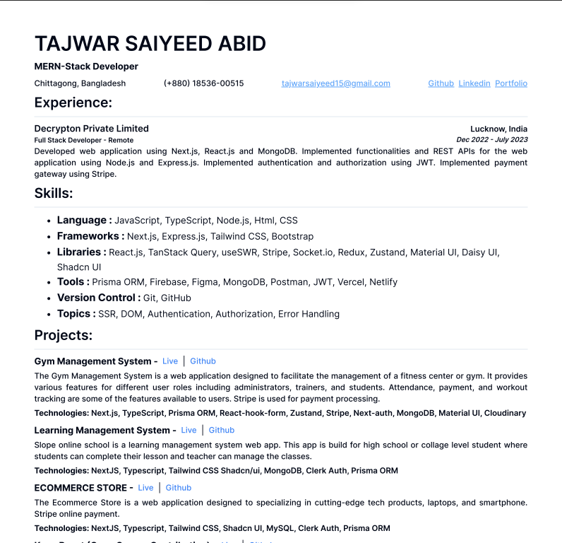

# Dev Resume Template ✨ AI-Powered

## 🚀 New Feature: AI Resume Generation

Generate professional resumes instantly using **Gemini 2.0 Flash AI**! Simply describe your ideal resume, and our AI will create a complete, professional resume with:

- ✨ **Smart Content Generation** - Professional descriptions and achievements
- 🎯 **Role-Specific Optimization** - Tailored content for your target position
- 📊 **Structured Data** - Properly formatted sections and information
- 🖨️ **Ready to Export** - Print or download immediately

### Quick Setup for AI Features

1. Get your Gemini API key from [Google AI Studio](https://aistudio.google.com/app/apikey)
2. Copy `.env.example` to `.env.local`
3. Add your API key: `GEMINI_API_KEY=your_key_here`
4. Start generating resumes with AI!

# Open Source Contributions

    
    
    
    
    

    
    

List of actively participating individulas in open source contributions

- Add Changes to the project
- Add your own details to the contributor list
- Make a Pull Request
- Wait for it to be merged
- See your name on the list
- Celebrate 🎉
- Share with your friends
- Star this repo
- Contribute more

    
    

## Contributors 🍉

Thanks goes to these wonderful people (😊):

<!-- ALL-CONTRIBUTORS-LIST:START - Do not remove or modify this section -->
<!-- prettier-ignore-start -->
<!-- markdownlint-disable -->
<table>
    <tbody>
        <tr>
            <td align="center">
                <a href="https://portfolio-tsa.vercel.app/home">
                    
                     
                    <b>Tajwar Saiyeed</b>
                </a> 
            </td>
</tr>
</tbody>
</table>
